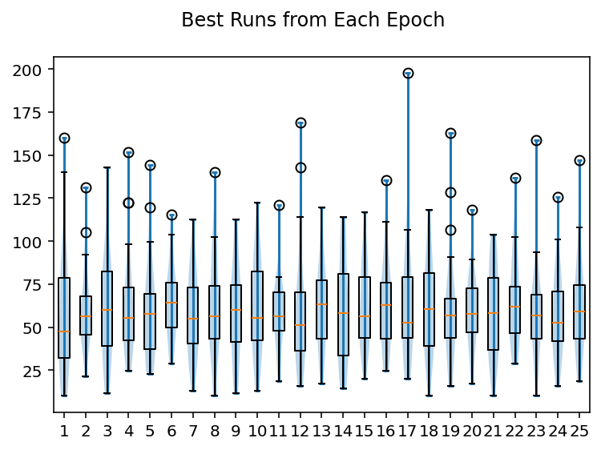

# GP Search
A genetic programming search. Allows for standard evolution for PacMan controllers with randomly initialized Ghost controllers, or for a competitive co-evolutionary approach.

# How to run?
Currently, running main.py in the console will work. Eventually, I'll get around to adding a config file and a more professional implementation.

# Parameters
- mdepth - Maximum depth for controller tree
- bsize - Number of branches
- tprob - Tree structural variation probability
- xdim - World x-dimension
- ydim - World y-dimension
- wden - Wall density
- ppill - Pill density
- rnginit - Seed
- nghosts - Number of ghosts (GPac visualizer requires 3. nghosts should always be less than popsize)
- fprob - Fruit generation probability for each step.
- gtime - Game time limit
- survivors - Number of survivors for each generation
- k - Tournament size for ktournament
- epochs - Number of epochs to run
- selection - Determines which selection to use. Currently, only fitness proportional (fitprop) and k-tournament (ktournament) are implemented.
- evghosts - If true, runs a competitive, co-evolutionary algorithm. If false, ghosts do not evolve over time.

# What does it do?
Currently, it initializes a population (popsize) and a number of randomly generated worlds (nworlds). For each epoch, it will run the current population of PacMen against a number of randomly selected Ghosts. After running each epoch, it will cull the worst performing members and then randomly generate children from parents selected through the selection criteria. Evolution will continue until the specified number of epochs are reached.

The mean of each epoch, displaying convergence.

The scores from the best PacMan of each epoch do not converge in 25 epochs.

# What's next?
Cleaning up code, converting parsimony pressure to a pareto optimal solution, adding more selection criteria, adding operators, and adding a wider variety of tree mutations!